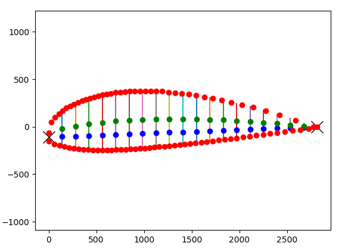
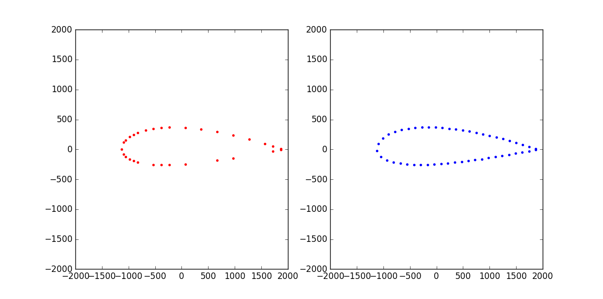
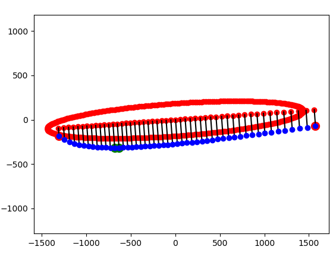
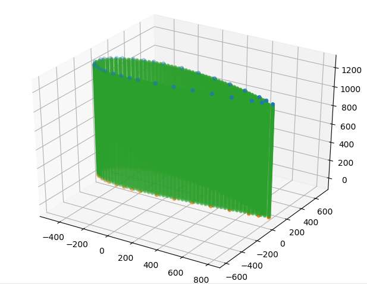
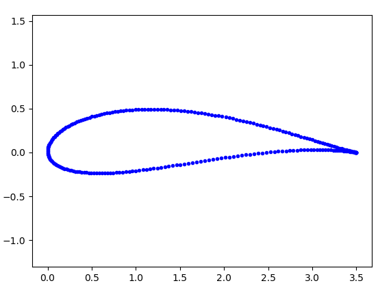

# Wind Turbine Blade Python 2D Analysis Functions
 A set of functions for analysis of 2D slices from wind turbine blades produced by LiDAR and range sensor data.
 
# Detect What The Capture Blade Is

A function for extracting shape data from a captured 2D slices of a wind turbine blade. The length, thickness and camber of the captured blade segment are extracted and used to recompute a mathematical representation of the blade, free of noise. Based on this the type of the imaged blade can be detected. A testing scenario is given using parts of blades scanned by hand with a LiDAR and comparing them to possible blade types. The mathematical calculation of the blade is taken from https://github.com/dgorissen/naca

Numpy and Scipy are needed for running the code

# Wind Turbine Blade Interpolate 2D

A simple Python implementation for interpolating missing points in a 2D scan. The points need to follow a certain order. The code produces a fast output, but can have problems if too many points are missing

Numpy is needed for running the code

# Calculate Longest and Shortest Side Of Blade Scan

A code snippet for detecting the orientation, longest and shortest side of a wind turbine blade 2D scan. The code can be used as part of a Iteractive Closest Point algorithm or a  SLAM algorithm. Uses PCA for calculating the eigenvalues and eigenvectors.

Numpy is needed for running the code

# Create 3D Point Cloud From 2D Blade Scan

An algorithms for interpolating a 2D scan to a 3D point cloud of a wind turbine blade. The input 2D scan is interpolated and densified, a Z-direction is chosen and the 2D points are interpolated at a specified height. The code can also interpolate between two different 2D scans, this can be used if individual 2D scans exist of a wind turbine blade to combine them and interpolate between then to create a 3D approximation of the wind turbine blade.

Numpy and Scipy are needed for running the code

# Joukowski Airfoil Calculator Python

A python implementation of the Joukowski airfoil calculator, using a given chord length, camber and thinkness to calculate a 2D slice of a airfoil/wind turbine blade.

Numpy is needed for running the code

